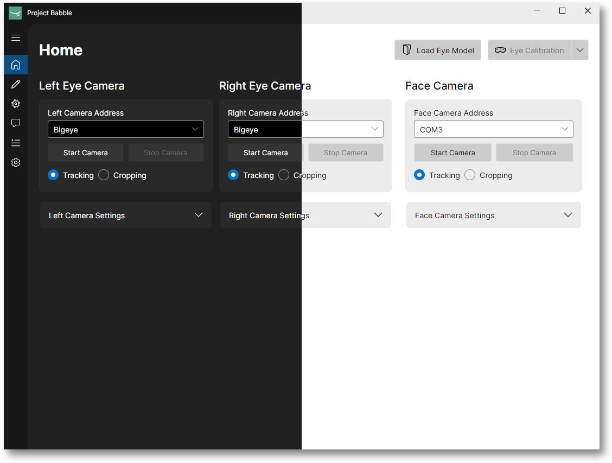

# Baballonia

**Baballonia** is a cross-platform, hardware-agnostic VR eye and face tracking application.

## Installation

### Windows

Head to the releases tab and [download the latest installer](https://github.com/Project-Babble/Baballonia/releases/latest).

You may be prompted to download the .NET runtime for desktop apps, install it if needs be.

### MacOS & Linux

Baballonia currently does not have an installer for macOS or Linux. You will need to follow our build instructions and run it from source.

Baballonia *can* be run through Wine, as documented on the [Linux VR Adventures Wiki](https://lvra.gitlab.io/docs/other/bigscreen-beyond/#bigscreen-beyond-2e-eyetracking-via-baballonia-under-linux).

#### NixOS (Flakes)

Simply run Baballonia with ``nix run github:Project-Babble/Baballonia``

## Platform Compatibility

### VRChat

#### VRCFaceTracking

To use Baballonia with VRChat, you will need to use VRCFaceTracking with the `VRCFT-Babble` module.

1. Download and install the latest version of VRCFaceTracking from [Steam](https://store.steampowered.com/app/3329480/VRCFaceTracking/).
1. Install the `VRCFT-Babble` module within VRCFaceTracking.
1. Use Baballonia to set the module mode (eyes, face or both). Restart VRCFaceTracking to see your changes.

More information can be found on the [VRCFT Docs](https://docs.vrcft.io/docs/vrcft-software/vrcft\#module-registry)

#### VRC Native Eyelook

Alternatively, Baballonia also supports [VRC Native Eyelook](https://docs.vrchat.com/docs/osc-eye-tracking).

While this doesn't support lower face tracking, it supports (almost) all VRChat Avatars.

### Resonite / ChilloutVR

Existing mods *should* be compatible with Baballonia's lower face tracking.

## Supported Hardware

Baballonia supports many kinds of hardware for eye and face tracking:

| Device                            | Eyes | Face | Notes                                                       |
|-----------------------------------| ----- | ----- |-------------------------------------------------------------|
| Official Babble Face Tracker      | :x: | ✅ |                                                             |
| DIY and 3rd party Babble Trackers | :x: | ✅ |                                                             |
| Vive Facial Tracker               | :x: | ✅ | Linux Only, WIP                                             |
| DIY EyetrackVR                    | ✅ | :x: |                                                             |
| Bigscreen Beyond 2E               | ✅ | :x: |                                                             |
| Vive Pro Eye                      | ✅ | :x: | Requires [Revision](https://github.com/Blue-Doggo/ReVision) |
| Varjo Aero                        | ✅ | :x: | Requires the Varjo Streamer                                 |
| HP Reverb G2 Omnicept             | ✅ | :x: | Requires [BrokenEye](https://github.com/ghostiam/BrokenEye) |
| Pimax Crystal                     | ✅ | :x: | Requires [BrokenEye](https://github.com/ghostiam/BrokenEye) |

---

## Build Instructions

If you want to build from source, clone this repo, its submodules and open the `.sln`/`.csproj` files in an editor of your choice. This has been tested and built on Visual Studio 2022 and Rider, but it should work with other IDEs.

### The Desktop App

To build the desktop app, build and load the following projects:

- `Baballonia.OpenCVCapture`
- `Baballonia.SerialCameraCapture`
- `HyperText.Avalonia`
- `Baballonia`
- `Baballonia.SDK`
- `Baballonia.Desktop`
- Optionally, `Baballonia.Tests`

Run `Baballonia.Desktop`.

#### Windows Notes - Trainer instructions

In order to use the trainer, you must first a) download its dependencies or b) build them yourself. You can accomplish this by:
- a) Run the `fetch_internal.ps1` script once after a clone. This will download and place the `_internal.zip` file into your `Baballonia.Desktop` project
- b) Run `pyinstaller` on the `trainermin.py` file, zip up its `internal` directory contents into an archive called `_internal.zip` and place it in the `Baballonia.Desktop` project

#### Linux notes

`libtesseract 4` is deprecated in newer repositories, but is needed to build.

### The Mobile App

To build the Android mobile app, build and load the following projects:

- `Baballonia.OpenCVCapture`
- `Baballonia.IPCameraCapture`
- `HyperText.Avalonia`
- `Baballonia`
- `Baballonia.SDK`
- `Baballonia.Android`
- Optionally, `Baballonia.Tests`

`Baballonia.Android` will produce an APK you can install on an Android device (and Quest HMD).

### The VRCFaceTrackingModule

To build the VRCFaceTracking module, you'll want to build and load the following projects:

- `VRCFaceTracking.Core`
- `VRCFaceTracking.SDK`
- `VRCFaceTracking.Baballonia`

`VRCFaceTracking.Baballonia` will produce a `.zip` module you can install, as well as the module DLL.

